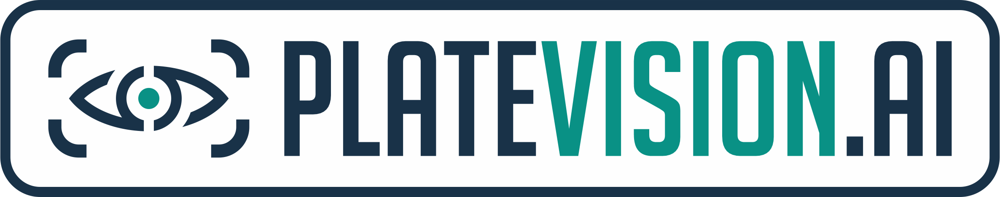
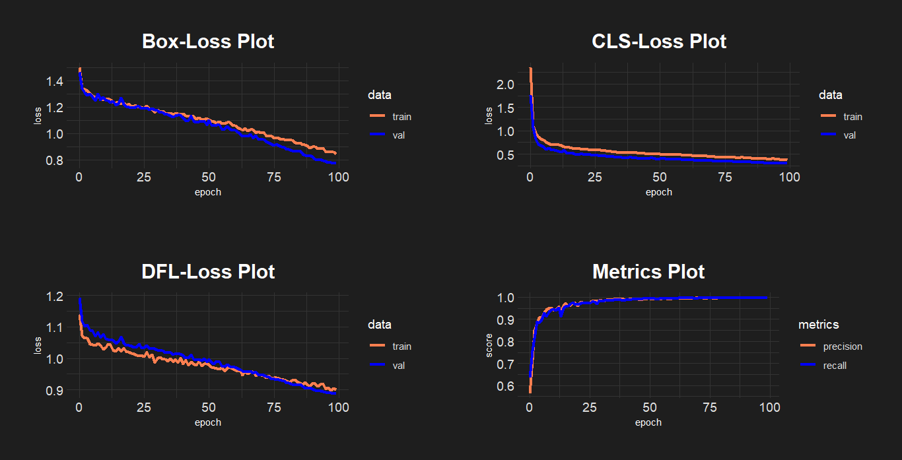

# PlateVision.AI

PlateVision.AI adalah sebuah aplikasi yang memanfaatkan teknologi kecerdasan buatan untuk prediksi plat nomor kendaraan dengan tingkat akurasi yang sangat tinggi. Dengan menggunakan model YOLOv5x, PlateVision.AI mampu mengenali dan memprediksi plat nomor dengan akurasi mencapai 99 persen. Dengan kombinasi kekuatan teknologi YOLOv5x dan pelatihan dataset yang komprehensif, PlateVision.AI memberikan solusi efisien dan andal untuk mengenali plat nomor kendaraan secara otomatis dan akurat.

## Model YOLOv5x

**YOLOv5x** merupakan varian YOLO dengan arsitektur xlarge yang menggabungkan elemen penting dari model YOLOv5 dan head split anchor-free yang sebelumnya diperkenalkan pada model YOLOv8. Hal ini menghasilkan keseimbangan yang lebih baik antara akurasi dan kecepatan dalam tugas deteksi objek. YOLOv5x menyediakan parameter pelatihan yang dapat disesuaikan, termasuk jumlah epoch, ukuran gambar input, batch size, dan lainnya. Grafik kurva pelatihan juga tersedia untuk memberikan gambaran mengenai performa model.

### Parameter Pelatihan Model

| Parameter       | Nilai | Keterangan                                     |
|-----------------|-------|------------------------------------------------|
| epochs          | 100   | Jumlah epoch pelatihan                         |
| imgsz           | 320   | Ukuran gambar input sebagai bilangan bulat    |
| batch           | 16    | Jumlah gambar per batch                        |
| lr0             | 0.001 | Tingkat pembelajaran awal                      |
| lrf             | 0.01  | Tingkat pembelajaran akhir (lr0 * lrf)         |
| dropout         | 0.2   | Penggunaan regulasi dropout (klasifikasi)      |
| optimizer       | AdamW | Optimizer yang digunakan                      |
| momentum        | 0.937 | Momentum SGD/beta1 Adam                       |
| weight_decay    | 0.0005| Weight decay optimizer 5e-4                   |
| warmup_epochs   | 3.0   | Jumlah epoch pemanasan                        |
| warmup_momentum | 0.8   | Momentum awal pemanasan                       |
| warmup_bias_lr  | 0.1   | Learning rate awal pemanasan                  |
| iou             | 0.7   | Intersection over Union                        |
| max_det         | 300   | Jumlah deteksi maksimal                        |

### Metrik Pelatihan Model

## Tutorial Penggunaan

Anda dapat mengakses aplikasi PlateVision.AI melalui [tautan ini](https://platevision-ai.streamlit.app/). Dalam aplikasi, Anda dapat memilih jenis input gambar (satuan atau banyak), mengunggah gambar-gambar kendaraan, dan melihat hasil prediksi plat nomor.

### Penggunaan dengan Git Clone

Jika Anda ingin menjalankan aplikasi PlateVision.AI secara lokal, Anda dapat mengikuti langkah-langkah berikut:

1. Clone repositori: `git clone https://github.com/dzakwanalifi/PlateVision.AI.git`
2. Masuk ke direktori repositori: `cd PlateVision.AI`
3. Instal dependensi: `pip install -r requirements.txt`
4. Jalankan aplikasi: `streamlit run app.py`

Pastikan Anda telah menginstal Python dan pip sebelum menjalankan langkah-langkah di atas.
